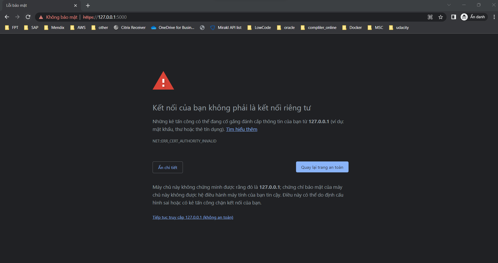
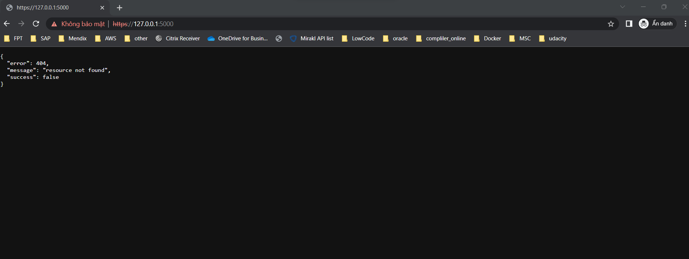

# Coffee Shop Full Stack

## Full Stack Nano - IAM Final Project

Udacity has decided to open a new digitally enabled cafe for students to order drinks, socialize, and study hard. But they need help setting up their menu experience.
## Backend
You must run command
````console
python -m virtualenv env
source env/Scripts/activate
pip3 install -r requirements.txt
export FLASK_APP=src/api.py
flask run --cert=adhoc --reload
````

## Fronrend

you run command
`ionic serve`
You access  Link: https://127.0.0.1:5000/





